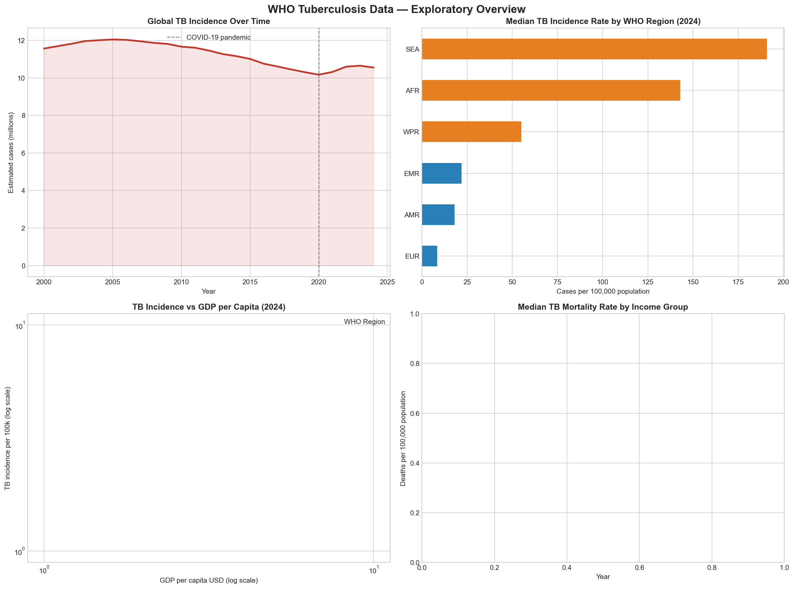

# WHO Tuberculosis Data — Information Visualisation

    

> [Add a one or two sentence description of what this project is and why you made it — something personal about your interest in the topic is good here]

---



---

## Project Goal

[Describe the central question this visualisation tries to answer — e.g. something about TB's re-emergence and its relationship to global poverty/deprivation]

---

## Project Structure

```
WHO-tuberculosis-analysis/
├── data/
│   ├── raw/                        # Original downloaded files (not committed to git)
│   │   ├── who_estimates.csv
│   │   ├── who_estimates_age_sex.csv
│   │   └── worldbank_gdp.csv
│   └── processed/                  # Cleaned and merged datasets
│       ├── core.csv
│       └── risk_factors.csv
├── code/
│   ├── 01_download_and_explore.py  # Data loading, merging, exploratory plots
│   └── 02_visualisations.py        # [Final visualisation — to be added]
├── outputs/                        # Generated charts and figures
├── docs/                           # Design document
└── README.md
```

---

## Data Sources

### WHO Global TB Report (2025)
- **Source:** [WHO Global Tuberculosis Programme](https://www.who.int/teams/global-tuberculosis-programme/data)
- **Files used:** TB Burden Estimates, Incidence disaggregated by Age/Sex/Risk Factor
- **Coverage:** [Note the year range covered — e.g. 2000–2024, 215 countries]
- **License:** Subject to [WHO data policy](https://www.who.int/about/policies/publishing/data-policy)

### World Bank GDP per Capita
- **Source:** [World Bank Open Data](https://data.worldbank.org/indicator/NY.GDP.PCAP.CD)
- **Used for:** Classifying countries by income group as a proxy for social deprivation
- **License:** CC BY 4.0

---

## Key Variables

| Variable | Description |
|---|---|
| `e_inc_100k` | Estimated TB incidence rate per 100,000 population |
| `e_mort_100k` | Estimated TB mortality rate per 100,000 population |
| `e_inc_tbhiv_100k` | TB incidence in HIV-positive people per 100,000 |
| `c_cdr` | Case detection rate (treatment coverage) |
| `risk_factor` | Risk factor code: `alc`, `smk`, `dia`, `hiv`, `und` |
| `g_whoregion` | WHO region: AFR, SEA, WPR, EMR, EUR, AMR |
| `gdp_per_capita` | GDP per capita USD (World Bank, most recent year) |
| `income_group` | Derived: Low / Lower-middle / Upper-middle / High income |

---

## How to Run

### Prerequisites
```bash
pip install pandas matplotlib seaborn plotly requests
```

### Steps

1. **Download the raw data** — see instructions at the top of `01_download_and_explore.py`

2. **Run exploratory analysis**
```bash
python code/01_download_and_explore.py
```

3. **Run final visualisation**
```bash
python code/02_visualisations.py
```

---

## Key Insights

> [Fill this in once you have explored the data and built your visualisation — what did you find? What surprised you?]

- [Insight 1]
- [Insight 2]
- [Insight 3]

---

## Design Decisions

> [Brief summary of your encoding choices — expand on this in the 2-page design document]

[Note the chart types you chose and why — refer to the full rationale in docs/design_document.pdf]

---

## Assignment Deliverables

| Deliverable | Status |
|---|---|
| Dataset identified & downloaded | Done |
| Data cleaning & processing script | Done |
| Exploratory analysis | Done |
| Final visualisation | To do |
| 2-page design document | To do |
| 5-minute demo video | To do |

---

## Author

**[Your Name]**  
[Your course / module name]  
[Your institution]  
Submitted: 27 April 2026

---

> *Data sourced from the WHO Global Tuberculosis Report 2025 and World Bank Open Data. Used for academic purposes only.*